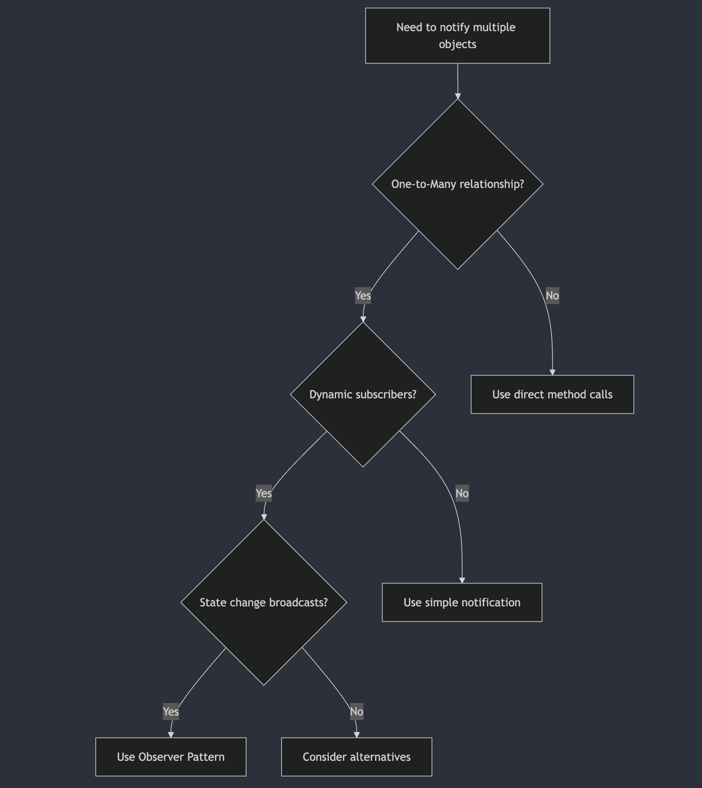
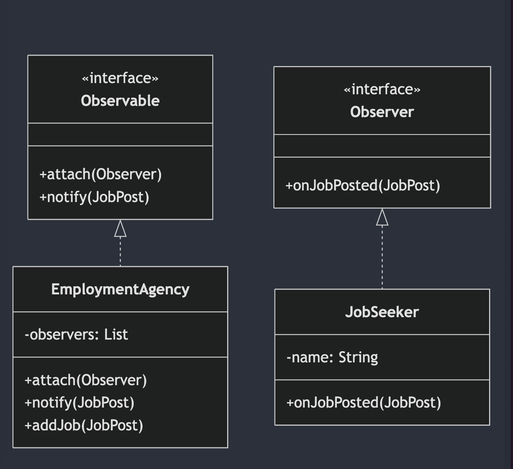

# Observer Pattern Implementation Guide

## 1. Overview

### What is the Observer Pattern?

The Observer pattern establishes a one-to-many dependency between objects. When the state of one object (the subject) changes, all its dependents (observers) are automatically notified and updated. This pattern is crucial for building decoupled systems where components can react to state changes without tightly binding to the source of those changes.

In this guide, we illustrate the Observer pattern through a job notification system. Here, an employment agency (the subject) notifies job seekers (observers) about new job postings.

### Key Components

1.  **Subject (Observable)**
    *   Maintains a list of observers.
    *   Provides methods to attach and detach observers.
    *   Notifies observers when a state change occurs.

2.  **Observer**
    *   Defines an interface for receiving update notifications.
    *   Receives updates from the subject.

3.  **Concrete Subject**
    *   Implements the Subject interface.
    *   Manages the list of observers.
    *   Sends notifications to observers when its state changes.
    *   Example: `EmploymentAgency`

4.  **Concrete Observer**
    *   Implements the Observer interface.
    *   Receives and processes updates from the subject.
    *   Example: `JobSeeker`

### Workflow

1.  Observers register with the Subject.
2.  The Subject's state changes.
3.  The Subject notifies all registered Observers.
4.  Each Observer updates its state accordingly.

### Correct Implementation vs. Violations

#### ✅ Correct Implementation
```java
// Subject interface
public interface Observable {
    void attach(Observer observer);
    void notify(JobPost jobPosting);
}

// Concrete subject
public class EmploymentAgency implements Observable {
    private List<Observer> observers = new ArrayList<>();
    
    public void attach(Observer observer) {
        observers.add(observer);
    }
    
    public void notify(JobPost jobPosting) {
        observers.forEach(observer -> observer.onJobPosted(jobPosting));
    }
}
```

#### ❌ Common Violations

1. **Direct Dependencies (Violation of Observer Pattern)**
```java
// Bad: Tight coupling
class JobPortal {
    private JobSeeker jobSeeker;
    
    public void postJob(JobPost job) {
        jobSeeker.notify(job);  // Direct dependency
    }
}
```

## 2. Design Pattern Framework

### Decision Flowchart


### Component Diagram


## 3. Implementation Details

### Core Components

1. **Observable Interface**
```java
public interface Observable {
    void attach(Observer observer);
    void notify(JobPost jobPosting);
}
```

2. **Observer Interface**
```java
public interface Observer {
    void onJobPosted(JobPost job);
}
```

### Best Practices

1. **Thread-safe Observer List**
```java
// Use concurrent collection for thread safety
private List<Observer> observers = Collections.synchronizedList(new ArrayList<>());
```

2. **Weak References for Observers**
```java
private List<WeakReference<Observer>> observers = new ArrayList<>();
```

## 4. SOLID Principles Application

### Single Responsibility
✅ **Correct:**
```java
public class EmploymentAgency implements Observable {
    private List<Observer> observers = new ArrayList<>();
    
    public void addJob(JobPost jobPosting) {
        notify(jobPosting);
    }
}
```

❌ **Violation:**
```java
public class EmploymentAgency {
    private List<Observer> observers = new ArrayList<>();
    
    public void addJob(JobPost jobPosting) {
        validateJob(jobPosting);  // Job validation logic
        persistJob(jobPosting);   // Database operations
        notify(jobPosting);       // Notification logic
    }
}
```

## 5. Common Anti-patterns

1. **Memory Leak Anti-pattern**
❌ **Incorrect:**
```java
public class EmploymentAgency {
    private List<Observer> observers = new ArrayList<>();
    // No method to remove observers - potential memory leak
}
```

✅ **Correct:**
```java
public class EmploymentAgency {
    private List<Observer> observers = new ArrayList<>();
    
    public void detach(Observer observer) {
        observers.remove(observer);
    }
}
```

## 6. Testing Strategy

### Unit Tests
```java
@Test
void shouldNotifyAllObservers() {
    // Arrange
    EmploymentAgency agency = new EmploymentAgency();
    Observer observer1 = mock(Observer.class);
    Observer observer2 = mock(Observer.class);
    agency.attach(observer1);
    agency.attach(observer2);
    
    // Act
    JobPost job = new JobPost("Developer");
    agency.addJob(job);
    
    // Assert
    verify(observer1).onJobPosted(job);
    verify(observer2).onJobPosted(job);
}
```

## 7. Real-world Impact

### Scalability
```java
public class ScalableEmploymentAgency implements Observable {
    private final ExecutorService executorService = Executors.newFixedThreadPool(10);
    
    @Override
    public void notify(JobPost jobPosting) {
        observers.forEach(observer -> 
            executorService.submit(() -> observer.onJobPosted(jobPosting))
        );
    }
}
```

## 8. Interview Questions

Q1: How would you handle concurrent modifications to the observer list?
A1: Use thread-safe collections or synchronization:
```java
private final List<Observer> observers = Collections.synchronizedList(new ArrayList<>());
// or
private final CopyOnWriteArrayList<Observer> observers = new CopyOnWriteArrayList<>();
```

## 9. Advanced Topics

### Thread Safety Implementation
```java
public class ThreadSafeEmploymentAgency implements Observable {
    private final ReadWriteLock lock = new ReentrantReadWriteLock();
    private final List<Observer> observers = new ArrayList<>();
    
    public void attach(Observer observer) {
        lock.writeLock().lock();
        try {
            observers.add(observer);
        } finally {
            lock.writeLock().unlock();
        }
    }
}
```

## 10. Helpful Tips

### Performance Monitoring
```java
public class MonitoredEmploymentAgency implements Observable {
    private final Metrics metrics = new Metrics();
    
    @Override
    public void notify(JobPost jobPosting) {
        long startTime = System.nanoTime();
        observers.forEach(observer -> observer.onJobPosted(jobPosting));
        metrics.recordNotificationTime(System.nanoTime() - startTime);
    }
}
```

### Error Handling
```java
@Override
public void notify(JobPost jobPosting) {
    observers.forEach(observer -> {
        try {
            observer.onJobPosted(jobPosting);
        } catch (Exception e) {
            logger.error("Failed to notify observer", e);
            // Continue with other observers
        }
    });
}
```

## 2. Common Anti-patterns and Solutions

### 1. Tight Coupling Anti-pattern
❌ **Problem:**
```java
// Anti-pattern: Direct coupling between subject and observers
public class NewsAgency {
    private NewsSubscriber subscriber1;
    private NewsSubscriber subscriber2;
    
    public void publishNews(String news) {
        subscriber1.receiveNews(news);
        subscriber2.receiveNews(news);
    }
}
```

✅ **Solution:**
```java
// Solution: Using Observer interface and dynamic observer list
public interface Observer {
    void update(String news);
}

public class NewsAgency {
    private List<Observer> observers = new ArrayList<>();
    
    public void attach(Observer observer) {
        observers.add(observer);
    }
    
    public void publishNews(String news) {
        observers.forEach(observer -> observer.update(news));
    }
}
```

### 2. Memory Leak Anti-pattern
❌ **Problem:**
```java
// Anti-pattern: No way to remove observers
public class EventManager {
    private List<Observer> observers = new ArrayList<>();
    
    public void subscribe(Observer observer) {
        observers.add(observer);
    }
    // Missing unsubscribe method leads to memory leaks
}
```

✅ **Solution:**
```java
public class EventManager {
    private List<WeakReference<Observer>> observers = new ArrayList<>();
    
    public void subscribe(Observer observer) {
        observers.add(new WeakReference<>(observer));
    }
    
    public void unsubscribe(Observer observer) {
        observers.removeIf(ref -> ref.get() == null || ref.get() == observer);
    }
}
```

### 3. Thread-Safety Anti-pattern
❌ **Problem:**
```java
// Anti-pattern: Not thread-safe
public class StockMarket {
    private List<Observer> observers = new ArrayList<>();
    
    public void addObserver(Observer o) {
        observers.add(o);  // Not thread-safe
    }
    
    public void notifyPrice(double price) {
        observers.forEach(o -> o.update(price));  // May throw ConcurrentModificationException
    }
}
```

✅ **Solution:**
```java
public class StockMarket {
    private final List<Observer> observers = Collections.synchronizedList(new ArrayList<>());
    private final ReadWriteLock lock = new ReentrantReadWriteLock();
    
    public void addObserver(Observer o) {
        lock.writeLock().lock();
        try {
            observers.add(o);
        } finally {
            lock.writeLock().unlock();
        }
    }
    
    public void notifyPrice(double price) {
        lock.readLock().lock();
        try {
            observers.forEach(o -> o.update(price));
        } finally {
            lock.readLock().unlock();
        }
    }
}
```

### 4. State Inconsistency Anti-pattern
❌ **Problem:**
```java
// Anti-pattern: Inconsistent state during updates
public class WeatherStation {
    private float temperature;
    private float humidity;
    
    public void setMeasurements(float temperature, float humidity) {
        this.temperature = temperature;
        notifyObservers();  // Observers get notified with incomplete state
        this.humidity = humidity;
        notifyObservers();  // Duplicate notifications
    }
}
```

✅ **Solution:**
```java
public class WeatherStation {
    private WeatherData weatherData;
    
    public void setMeasurements(float temperature, float humidity) {
        weatherData = new WeatherData(temperature, humidity);
        notifyObservers(weatherData);  // Atomic update with complete state
    }
}
```

### 5. Notification Order Dependency Anti-pattern
❌ **Problem:**
```java
// Anti-pattern: Observers depend on notification order
public class OrderSystem {
    private List<Observer> observers = new ArrayList<>();
    
    public void processOrder(Order order) {
        // Observers assume specific notification order
        observers.get(0).update(order);  // Validation
        observers.get(1).update(order);  // Processing
        observers.get(2).update(order);  // Notification
    }
}
```

✅ **Solution:**
```java
public class OrderSystem {
    private Map<Priority, List<Observer>> prioritizedObservers = new EnumMap<>(Priority.class);
    
    public void processOrder(Order order) {
        // Process observers based on priority, not position
        Arrays.stream(Priority.values())
              .forEach(priority -> 
                  prioritizedObservers.getOrDefault(priority, Collections.emptyList())
                                    .forEach(observer -> observer.update(order))
              );
    }
}
```

### 6. Expensive Operation in Notification Anti-pattern
❌ **Problem:**
```java
// Anti-pattern: Blocking operations in notification
public class DataCenter {
    public void notifyObservers(ServerStatus status) {
        observers.forEach(observer -> {
            observer.processStatus(status);  // Might be slow/blocking
        });
    }
}
```

✅ **Solution:**
```java
public class DataCenter {
    private final ExecutorService executorService = Executors.newFixedThreadPool(10);
    
    public void notifyObservers(ServerStatus status) {
        observers.forEach(observer -> 
            executorService.submit(() -> observer.processStatus(status))
        );
    }
}
```

### 7. Exception Handling Anti-pattern
❌ **Problem:**
```java
// Anti-pattern: No exception handling
public class NewsPublisher {
    public void notifyObservers(News news) {
        observers.forEach(observer -> observer.onNews(news));
        // One failed observer breaks the chain
    }
}
```

✅ **Solution:**
```java
public class NewsPublisher {
    public void notifyObservers(News news) {
        observers.forEach(observer -> {
            try {
                observer.onNews(news);
            } catch (Exception e) {
                logger.error("Failed to notify observer: " + observer, e);
                // Continue with other observers
            }
        });
    }
}
```

This implementation provides a solid foundation for using the Observer pattern in a job notification system, with considerations for threading, performance, and error handling.
