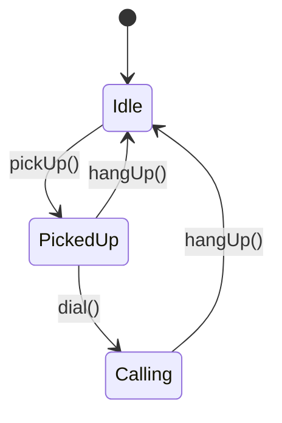

# State Design Pattern

## 🎯 Overview
The State pattern is like a vending machine that behaves differently based on its current state. Imagine a phone:
- When **idle**, you can pick it up
- When **picked up**, you can dial
- When **on a call**, you can hang up

Each state determines what actions are possible and how the object behaves.

### Real-World Examples
1. 📱 **Phone System** (Our main example)
2. 🤖 **Vending Machine**: States - Ready, Processing, OutOfStock
3. 📄 **Document Editor**: States - Editing, Reviewing, Locked
4. 🌐 **Network Connection**: States - Connected, Disconnected, Connecting

## 🔍 The Problem It Solves

### Traditional Approach (Anti-Pattern)
```java
class Phone {
    private String state;
    
    public void processAction(String action) {
        if (state.equals("idle")) {
            if (action.equals("pickUp")) {
                // Pick up logic
            } else if (action.equals("dial")) {
                throw new IllegalStateException("Can't dial when idle");
            }
        } else if (state.equals("pickedUp")) {
            // More conditional logic...
        }
        // More states = More complex conditions 😱
    }
}
```

### Problems with Traditional Approach
- ❌ Complex if-else statements
- ❌ Hard to add new states
- ❌ State logic scattered everywhere
- ❌ Easy to make mistakes

## 💡 Solution: State Pattern Implementation

### Our Phone Example Implementation

1. **Define State Interface**
```java
public interface PhoneState {
    PhoneState pickUp();
    PhoneState hangUp();
    PhoneState dial();
}
```

2. **Create Context Class**
```java
public class Phone {
    private PhoneState state;

    public Phone() {
        this.state = new PhoneStateIdle(); // Start in idle state
    }

    public void pickUp() {
        this.state = this.state.pickUp();
    }
    // ...other methods...
}
```

3. **Implement State Classes**
```java
// Idle State
public class PhoneStateIdle implements PhoneState {
    @Override
    public PhoneState pickUp() {
        return new PhoneStatePickedUp();  // Transition to picked up
    }

    @Override
    public PhoneState dial() {
        throw new IllegalStateException("Can't dial when idle!");
    }
    // ...other methods...
}
```

### State Transitions Diagram


## Decision Framework: When to Use State Pattern?

```
Does the object's behavior change based on internal state?
├── No → Use Simple Conditional Logic
└── Yes → Are multiple methods affected by state changes?
    ├── No → Use Enum/Flag with Switch Statement
    └── Yes → Are state transitions complex?
        ├── No → Use Strategy Pattern
        └── Yes → Do you need state history?
            ├── No → Does state have instance data?
            │   ├── No → Use Flyweight State Pattern
            │   └── Yes → Use Standard State Pattern ✅
            └── Yes → Need to restore states?
                ├── No → Use State Pattern with History List
                └── Yes → Use State + Memento Pattern ✅
```

### Decision Guide Explanation

1. **Does behavior change based on state?**
   - ✅ Use State Pattern if the object's behavior varies with its internal state
   - ❌ Use simple conditionals if behavior is mostly consistent

2. **Multiple methods affected?**
   - ✅ Use State Pattern if multiple methods change behavior based on state
   - ❌ Use simple enum/flag if only 1-2 methods are affected

3. **Complex transitions?**
   - ✅ Use State Pattern if transitions involve business rules or conditions
   - ❌ Consider Strategy Pattern if transitions are straightforward

4. **Need state history?**
   - ✅ Consider State + Memento if you need undo/redo capability
   - ❌ Use standard State Pattern if only current state matters

5. **Instance data in states?**
   - ✅ Use standard State Pattern if states need their own data
   - ❌ Consider Flyweight State Pattern if states are stateless

### Quick Reference Table

| Scenario | Solution | When to Use |
|----------|----------|-------------|
| Simple state | Conditional Logic | Few states, simple transitions |
| Multiple methods | State Pattern | Complex behavior changes |
| History needed | State + Memento | Undo/redo required |
| Stateless states | Flyweight State | Memory optimization needed |
| Complex transitions | Full State Pattern | Business rules involved |

### Detailed Decision Criteria
1. **Does behavior change based on state?**
   - ✅ YES: Methods behave differently in different states
   - ❌ NO: Behavior remains consistent

2. **Multiple methods affected?**
   - ✅ YES: Several methods change behavior with state
   - ❌ NO: Only one or two methods vary

3. **Complex state transitions?**
   - ✅ YES: Transitions involve business rules/conditions
   - ❌ NO: Simple, straightforward transitions

4. **State history needed?**
   - ✅ YES: Need undo/redo or audit functionality
   - ❌ NO: Only current state matters

5. **Instance data in states?**
   - ✅ YES: States need to maintain their own data
   - ❌ NO: States only contain behavior

### 📝 Decision Points Explained

1. **Does object behavior change based on internal state?**
   - ✅ YES if: Different methods behave differently depending on some internal condition
   - ❌ NO if: Object behavior is consistent regardless of internal values

2. **Are there multiple methods affected by state?**
   - ✅ YES if: More than one method changes behavior based on state
   - ❌ NO if: Only a single method is affected
   ```java
   // Example of multiple affected methods
   class Document {
       void save() { /* changes by state */ }
       void edit() { /* changes by state */ }
       void share() { /* changes by state */ }
   }
   ```

3. **Are state transitions complex/conditional?**
   - ✅ YES if: State changes depend on multiple conditions or have business rules
   - ❌ NO if: State changes are simple and straightforward
   ```java
   // Complex transition example
   if (currentState == DRAFT && isReviewed && hasApproval) {
       state = PUBLISHED;
   }
   ```

4. **Do you need to maintain state history?**
   - ✅ YES if: You need undo/redo functionality or audit trails
   - ❌ NO if: Previous states are not important
   ```java
   // State with history
   class DocumentState {
       private Stack<State> history = new Stack<>();
       void saveToHistory() {
           history.push(this.clone());
       }
   }
   ```

5. **Does state have instance data?**
   - ✅ YES if: States need to maintain their own data
   - ❌ NO if: States only contain behavior
   ```java
   // State with instance data
   class PlayingState implements MediaPlayerState {
       private int currentTime;
       private float volume;
   }
   ```

### 🎯 Quick Decision Guide

Use State Pattern when:
```java
// ✅ Multiple state-dependent behaviors
class VendingMachine {
    void insertMoney() { state.handleMoney(); }
    void dispenseItem() { state.dispense(); }
    void cancel() { state.handleCancel(); }
}

// ✅ Complex state transitions
class OrderState {
    State next() {
        if (isPaymentComplete && isInStock) {
            return new ProcessingState();
        } else if (!isInStock) {
            return new BackorderState();
        }
        return this;
    }
}

// ✅ Need for state history
class DocumentState {
    private List<State> history;
    void save() {
        history.add(clone());
    }
}
```

Don't use State Pattern when:
```java
// ❌ Simple boolean flag is sufficient
class Light {
    boolean isOn;
    void toggle() {
        isOn = !isOn;
    }
}

// ❌ Single method affected by state
class Process {
    boolean isRunning;
    void execute() {
        if (isRunning) return;
        // process logic
    }
}
```

### 🎯 Practical Examples

#### ✅ Good Use Cases

1. **Document Management System**
```java
interface DocumentState {
    void edit(Document doc);
    void review(Document doc);
    void publish(Document doc);
}

class DraftState implements DocumentState {
    void edit(Document doc) { /* allow edits */ }
    void review(Document doc) { 
        if (doc.isComplete()) {
            doc.setState(new ReviewState());
        }
    }
    void publish(Document doc) { throw new IllegalStateException(); }
}
```
Why? Multiple methods affected, complex transitions, clear state rules

2. **E-commerce Order Processing**
```java
interface OrderState {
    void process(Order order);
    void cancel(Order order);
    void refund(Order order);
    OrderState next(Order order);
}
```
Why? State history needed, complex business rules, multiple state-dependent behaviors

#### ❌ Overkill Scenarios

1. **Simple Toggle Functionality**
```java
// Don't use State Pattern for this
class LightSwitch {
    private boolean isOn = false;
    
    void toggle() {
        isOn = !isOn;
        updateLight();
    }
}
```
Why? Single boolean condition, one affected method

2. **Basic Status Tracking**
```java
// Don't use State Pattern for this
class Task {
    enum Status { TODO, DONE }
    private Status status = Status.TODO;
    
    void complete() {
        status = Status.DONE;
    }
}
```
Why? Simple state transition, no complex behavior changes

### 🎓 Rule of Thumb
Consider using State pattern when you answer "yes" to at least 2 of these:
1. Multiple methods change behavior based on state
2. State transitions have business logic
3. States need to maintain their own data
4. You need to track state history
5. Adding new states is a common requirement

### Code Hints for Decision Making

1. **Simple State (Use Conditional Logic)**
```java
// When behavior rarely changes
class Document {
    private boolean isLocked = false;
    
    void edit() {
        if (isLocked) {
            throw new IllegalStateException("Document is locked");
        }
        // Edit logic
    }
}
```

2. **Multiple Methods (Use State Pattern)**
```java
// When many methods change with state
class Document {
    private DocumentState state; // Use State Pattern
    
    void edit() { state.edit(); }
    void share() { state.share(); }
    void review() { state.review(); }
    void publish() { state.publish(); }
}
```

3. **Complex Transitions (Full State Pattern)**
```java
// When transitions have business rules
class DraftState implements DocumentState {
    @Override
    public DocumentState review() {
        if (!document.hasMinimumWords()) return this;
        if (!document.hasRequiredSections()) return this;
        if (!document.isFormatValid()) return this;
        return new ReviewState();
    }
}
```

4. **History Needed (State + Memento)**
```java
// When you need undo/redo
class Document {
    private Stack<DocumentState> history = new Stack<>();
    
    void saveState() {
        history.push(state.createMemento());
    }
    
    void undo() {
        if (!history.isEmpty()) {
            state = history.pop().restore();
        }
    }
}
```

5. **Stateless States (Flyweight Pattern)**
```java
// When states don't need instance data
class LockedState implements DocumentState {
    private static final LockedState INSTANCE = new LockedState();
    
    public static LockedState getInstance() {
        return INSTANCE;
    }
    // All methods are stateless
}
```

### Red Flags: When Not to Use State Pattern

❌ **Single Boolean State**
```java
// Don't overcomplicate this
class Light {
    private boolean isOn;
    void toggle() { isOn = !isOn; }
}
```

❌ **Simple Status Enum**
```java
// Don't use State Pattern for this
class Task {
    enum Status { TODO, IN_PROGRESS, DONE }
    private Status status = Status.TODO;
}
```

❌ **No Behavior Changes**
```java
// Don't use State Pattern when behavior is constant
class Calculator {
    // Methods behave the same regardless of state
    int add(int a, int b) { return a + b; }
    int subtract(int a, int b) { return a - b; }
}
```

## 🎓 Learning Guide

### For Beginners
1. **Key Concepts to Understand**
   - State = Behavior + Data
   - Each state is a separate class
   - States transition between each other
   - Context delegates to current state

2. **Common Gotchas**
   - Always initialize with a starting state
   - Handle invalid transitions gracefully
   - Keep states independent

3. **When to Use**
   - Object behavior changes with state
   - Many state-dependent methods exist
   - Complex state transitions needed

### For Mid-Level Engineers
1. **Advanced Patterns**
   - Singleton states (when stateless)
   - State factories for complex initialization
   - State history for undo/redo
   - Flyweight pattern for state pooling

2. **Performance Tips**
   ```java
   // Instead of creating new states each time
   public class PhoneStateIdle implements PhoneState {
       private static final PhoneStateIdle INSTANCE = new PhoneStateIdle();
       
       public static PhoneStateIdle getInstance() {
           return INSTANCE;
       }
       // ...methods...
   }
   ```

3. **Best Practices**
   - Use state machines for complex flows
   - Document state transitions
   - Consider persistence needs
   - Unit test each state independently

## 🎯 Benefits
1. **Clean Code**
   - Each state is isolated
   - Transitions are explicit
   - Easy to add new states

2. **Error Prevention**
   - Invalid operations caught early
   - State transitions controlled
   - Business rules enforced

3. **Maintainability**
   - States are independent
   - Changes localized
   - Easy to test

## 📚 Interview Practice

### Basic Questions
1. **Q**: What is the State pattern?
   **A**: A pattern that allows an object to change behavior when its internal state changes, appearing to change its class.

2. **Q**: State vs Strategy pattern?
   **A**: State changes behavior based on internal state transitions, Strategy allows swapping algorithms from outside.

### Advanced Questions
1. **Q**: How to handle shared data between states?
   **A**: Options:
   - Pass through transition methods
   - Store in context
   - Use shared state object
   ```java
   public class Phone {
       private PhoneState state;
       private CallData sharedData; // Shared across states
       
       public void setState(PhoneState state) {
           this.state = state;
           state.setSharedData(sharedData);
       }
   }
   ```

## 🚀 Practice Exercise
Implement a vending machine with states:
- States: Ready, ProcessingPayment, DispensingItem, OutOfStock
- Actions: insertMoney(), selectItem(), dispense()
- Challenge: Add error handling and money return functionality

## 📚 Additional Resources
- [Refactoring Guru - State Pattern](https://refactoring.guru/design-patterns/state)
- [Head First Design Patterns](https://www.oreilly.com/library/view/head-first-design/0596007124/)